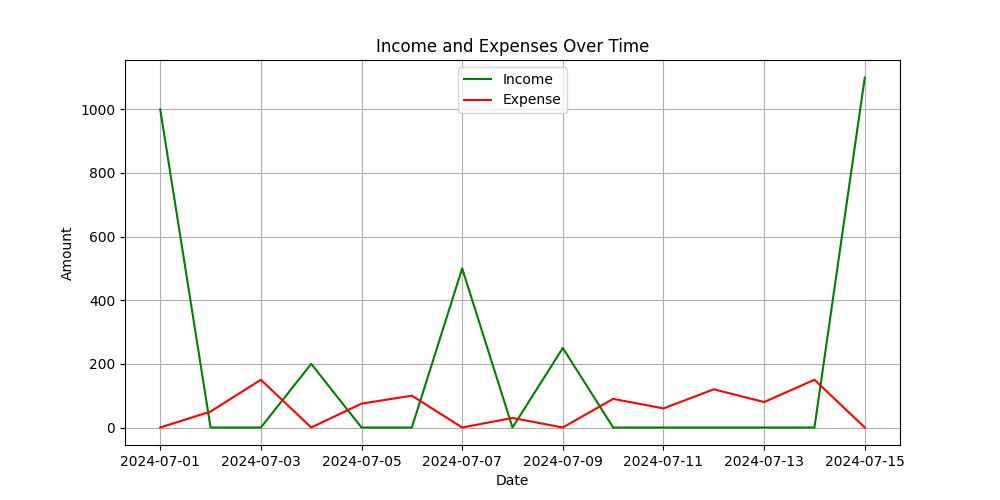

Hello:) Welcome to this Personal Finance Tracker Project!

It is based on a tutorial from [Tech With Tim](https://www.youtube.com/@TechWithTim).

# Personal Finance Tracker
In this repository you can find two scripts: [data_entry.py](data_entry.py) and [main.py](main.py).

**Example of output**
```
1. Add a new transaction.
2. View transactions and summary within a date range.
3. Exit.
Enter your choice (1-3): 2
Enter the start date (dd-mm-yyyy): 01-07-2024
Enter the end date (dd-mm-yyyy): 15-07-2024
Transaction from 01-07-2024 to 15-07-2024: 
      date  amount category     description
01-07-2024  1000.0   Income          Salary
02-07-2024    50.0  Expense       Groceries
03-07-2024   150.0  Expense       Utilities
04-07-2024   200.0   Income  Freelance Work
05-07-2024    75.0  Expense      Restaurant
06-07-2024   100.0  Expense       Transport
07-07-2024   500.0   Income           Bonus
08-07-2024    30.0  Expense          Snacks
09-07-2024   250.0   Income Stock Dividends
10-07-2024    90.0  Expense   Entertainment
11-07-2024    60.0  Expense          Coffee
12-07-2024   120.0  Expense             Gas
13-07-2024    80.0  Expense           Books
14-07-2024   150.0  Expense        Clothing
15-07-2024  1100.0   Income          Salary

Summary
Total Income: $3050.00
Total Expense: $905.00
Net Savings: $2145.00
Do you want to a see a plot?(y/n) y
```


*Plot of transactions carried out between 01-07-2024 and 15-07-2024.*

## GETTING INFORMATION FROM THE USER

The [data_entry.py](data_entry.py) allows user to input financial transactions, including income and expenses, along with details such as date, amount, category, and an optional description.

**Features**
- Date Input: Users can input a date for each transaction. If no date is provided, the current date is used by default. The date format is dd-mm-yyyy.
- Amount Validation: Ensures that the entered amount is a positive, non-zero value.
- Category Selection: Users can categorize each transaction as either Income (I) or Expense (E).
- Optional Description: Users can provide a brief description of the transaction.

## TRACKING PERSONAL FINANCE

The script [main.py](main.py) serves as a command-line tool for managing personal finances by tracking transactions, categorizing them as either income or expenses, and visualizing financial data over time.

- The script initializes the CSV file if it doesn't already exist.
- Users can specify a date range to view transactions within that period.

**User Interaction Options**

1. Add a new transaction.
2. View transactions and summary within a date range.
3. Exit.

If the user opts for Option 2, she/he can also plot the transactions over select period of time.

# How to run?

**Dependencies**
Ensure you have the required Python libraries installed:
- pandas
- matplotlib

**Run the script**
```
python main.py
```

# Which skills have I practiced with this tutorial?

1. How to define and use class methods (@classmethod).
2. Exception handling (try-except).
3. CSV Manipulation using CSV module and pandas library.
4. Plotting Data with matlplotlib.
5. Interactive Command-Line Programs.


